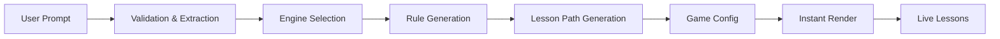

# 🎮 DreamPlay

**Tiny games for big thinkers**

DreamPlay transforms a child's imagination into playable games and interactive programming lessons. Kids describe a game in one sentence, and DreamPlay builds a complete mini-game that teaches real programming concepts through play.

> Built for ages 6-12 • No coding required • Instant feedback • Playful learning

---

## 📚 Table of Contents

- [What DreamPlay Does](#what-dreamplay-does)
- [Why This Matters](#why-this-matters)
- [How It Works](#how-it-works)
- [Learning System](#learning-system)
- [What Makes DreamPlay Different](#what-makes-dreamplay-different)
- [Game Examples](#game-examples)
- [For Kids, Parents & Teachers](#for-kids-parents--teachers)
- [Tech Architecture](#tech-architecture)
- [Setup & Installation](#setup--installation)
- [Future Improvements](#future-improvements)
- [License](#license)

---

## 🎯 What DreamPlay Does

Kids describe a small game in natural language. DreamPlay uses AI to generate:

- ✨ **A complete game config** — All rules, speeds, and behaviors
- 🎮 **One of three core engines** — Jump, Falling, or Collect
- 🕹️ **A playable mini-game** — Runs instantly in the browser
- 📖 **Live lessons** — Explains what changed and why

**The goal is simple:** Kids learn real programming thinking by changing numbers, tweaking rules, and watching everything update in real time.

---

## 💡 Why This Matters

DreamPlay teaches **logic and computational thinking** before kids ever touch syntax. Instead of typing code or dragging blocks, they learn by doing:

| Action               | Result                 | Concept Learned      |
| -------------------- | ---------------------- | -------------------- |
| Change speed         | Character moves faster | **Variables**        |
| Lower spawn rate     | Fewer obstacles appear | **Control flow**     |
| Increase jump height | Jump arc changes       | **Physics & timing** |

DreamPlay makes **cause and effect visible** in a fun, safe environment.

---

## 🚀 How It Works

### 1. Kids Describe a Tiny Game

They type one simple sentence like:

> _"Make a game where a ghost dodges flashlights and collects keys."_

**No code needed. Just imagination.**

### 2. AI Turns the Idea Into a Game Config

DreamPlay chooses a template that fits the idea for example:

- **Jump** — Platform-style obstacle avoidance
- **Falling** — Dodge objects coming from above
- **Collect** — Gather items while avoiding danger

The AI assigns visuals, speeds, rules, win conditions, and collision logic.

### 3. Kids Tweak Sliders and Rules

They control values such as:

- 🏃 Speed
- 🌍 Gravity
- ⬆️ Jump height
- ⏱️ Spawn interval
- 🚧 Number of obstacles

**Every change updates the game instantly.** This teaches variables, loops, timing, and event-based logic.

### 4. Live Lessons Explain What Changed

When a kid adjusts a slider, the lesson panel pops in. It explains the concept in simple, friendly language:

- Why movement speed changed
- How collisions work
- How the win rule is calculated
- What the game loop checks every moment

Each game is tagged with **programming concepts** it uses.

---

## 🧠 Learning System

DreamPlay highlights how real games are built. Every action teaches something:

### 📊 Variables

**Speed, gravity, jump height, spawn rate, and time.**  
Kids see how changing numbers changes real behavior.

### ⚡ Events

**Key press, game start, game over.**  
Kids learn that actions cause reactions.

### 🔀 Conditions

**If the hero hits an obstacle, you lose. If you reach the goal, you win.**  
Kids understand decision-making logic.

### 🔁 Loops and Repetition

**Obstacles keep spawning. Time keeps increasing. Movement keeps updating.**  
Kids feel the logic inside every frame.

### 🎲 Physics and Timing

**Jump arcs, falling speed, acceleration.**  
Kids build real-world intuition.

### 🎯 Cause and Effect

**Change one rule and watch the entire game react.**  
That's the heart of programming.

---

## ✨ What Makes DreamPlay Different

### 🌟 Imagination First, Code Later

Kids use natural language. DreamPlay handles the logic behind the scenes. When they're older, Scratch or JavaScript makes more sense because **the ideas already feel familiar**.

### 🔒 Safe and Simple to Run

Everything runs in the browser. **No logins, no accounts, no chat, no social features.** It works on Chromebooks, tablets, and family laptops.

### 🎓 Built for Learning, Not Distraction

DreamPlay focuses on logic, not flashy animations. Kids build a **mental model** of how systems work.

---

## 🎮 Game Examples

### 🦘 Jump and Dodge

Jump over obstacles while collecting stars.  
**Teaches:** Timing and event-based input

### ⭐ Collect the Stars

Move across the screen and gather items while avoiding danger.  
**Teaches:** Position tracking and win rules

### 🧱 Avoid the Falling Blocks

Survive as long as possible while objects fall.  
**Teaches:** Speed, collisions, and the game loop

---

## 👥 For Kids, Parents & Teachers

### 🧒 For Kids

**Feel like a real game designer.** Your idea becomes a game in seconds.

- ✅ Instant results
- ✅ No wrong answers
- ✅ Learn by playing

### 👪 For Parents

A calm activity with **real educational value**.

- ✅ No accounts
- ✅ No data collection
- ✅ No ads

### 👩‍🏫 For Teachers

Perfect for one class period or a full unit.

- ✅ Works on school devices
- ✅ Teaches logic and systems thinking
- ✅ No student sign-in needed

---

## 🛠️ Tech Architecture

DreamPlay is powered by a simple but flexible architecture designed for **fast iteration** and **real-time learning**.

### Core Stack

| Technology            | Purpose                             |
| --------------------- | ----------------------------------- |
| **Next.js 15**        | Frontend framework                  |
| **Clerk**             | Optional authentication             |
| **Anthropic Claude**  | Game refinement & lesson generation |
| **Browser 2D Engine** | Running tiny games                  |
| **TailwindCSS**       | UI styling                          |

### Game Engines

DreamPlay uses multiple small, config-driven engines such as:

1. **Jump** — Platform mechanics
2. **Falling** — Survival gameplay
3. **Collect** — Exploration and gathering

Each engine is driven by:

- Config objects
- Speed variables
- Spawn intervals
- Collision detection
- Win and loss checks

**The entire engine is config-based.** No dynamic code generation. Kids change numbers, not code.

### AI Pipeline



---

## 🚀 Setup & Installation

You can run DreamPlay locally in a few minutes.

### 1. Clone the Repository

```bash
git clone https://github.com/YOUR_USERNAME/dreamplay.git
cd dreamplay
```

### 2. Install Dependencies

```bash
npm install
```

### 3. Create Environment File

Create a file called `.env` in the root folder:

```bash
ANTHROPIC_API_KEY="your_api_key_here"
```

> ⚠️ **Important:** You must add your actual Anthropic API key.

### 4. Start the Development Server

```bash
npm run dev
```

Your project will be running locally at:  
🌐 **http://localhost:3000**

### 5. Start the Backend Server (if separate)

```bash
npm run server
```

---

## 🔮 Future Improvements

- 🎨 **More engines** — Racing, puzzle, adventure modes
- 🖼️ **Dynamic art styles** — Let kids choose visual themes
- 💻 **Code view mode** — For older kids ready to see the logic
- 🏫 **Classroom mode** — Teacher dashboards and progress tracking
- 💾 **Save and share** — Let kids export and share their games

---

## 📄 License

**MIT License** — Feel free to remix and build on top of DreamPlay.

---

<div align="center">

**Made with ❤️ for young game designers**

[Report Bug](https://github.com/saady789) • [Request Feature](https://github.com/saady789)

</div>
